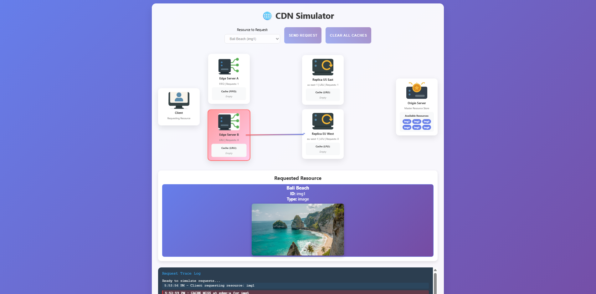

# CDN Simulator
[](https://github.com/nikolasarafimov/cdn-simulator/actions/workflows/ci.yml)

A Spring Boot application that simulates the core behavior of a **Content Delivery Network (CDN)**, including multi-layer caching, request routing, load balancing, cache eviction strategies, request tracing, and origin-server fallback.

The simulator provides an interactive interface that visualizes how resource requests travel through edge servers, replica servers, and the origin server while tracking cache hits, cache misses, per-server request counts, and overall cache performance.

---

## Live Demo

**Try the deployed application:** [cdn-simulator.onrender.com](https://cdn-simulator.onrender.com/)



The visualization shows requests travelling through edge and replica servers, cache hit/miss states, resource delivery, and request tracing in real time.

---

## Features

### Multi-Layer CDN Topology

The simulated CDN contains the following logical layers:

```text
Client
  ↓
Edge Server
  ↓
Replica Server
  ↓
Origin Server
```

The default topology contains:

- 2 edge servers
- 2 replica servers
- 1 origin server
- Cache capacity of 2 resources per caching server

The configured servers use different cache replacement strategies:

| Server | Layer | Cache Strategy |
|---|---|---|
| `edge-a` | Edge | FIFO |
| `edge-b` | Edge | LRU |
| `replica-us-east` | Replica | LRU |
| `replica-eu-west` | Replica | LFU |

This allows multiple cache eviction strategies to operate within the same simulated CDN topology.

---

## Caching Algorithms

The project implements three cache replacement strategies.

### FIFO

**First In, First Out** removes the resource that entered the cache first when the configured cache capacity is reached.

### LRU

**Least Recently Used** removes the resource that has not been accessed for the longest period of time.

Accessing a cached resource updates its recency.

### LFU

**Least Frequently Used** removes the resource with the lowest access frequency.

Each successful cache access increases the resource's frequency counter.

---

## Request Routing

Requests are routed to the **least-loaded edge server** based on the number of requests handled by each edge server.

For each client request:

1. The least-loaded edge server is selected.
2. The edge server checks its local cache.
3. If the resource is found, it is returned immediately.
4. If the edge cache misses, the request is forwarded to the replica server assigned to that edge.
5. The replica server checks its own cache.
6. If the replica cache also misses, the resource is retrieved from the origin server.
7. The retrieved resource is cached along the return path.
8. The resource is delivered to the client.

Edge request counters are used to distribute requests across the available edge servers.

---

## Request Tracing

Each simulated client request generates a backend trace describing the route taken through the CDN.

Every trace hop contains:

- Server identifier
- Server layer
- Cache hit or miss status
- Cache contents at that point in the request

Example:

```text
Client
  ↓
edge-a              CACHE MISS
  ↓
replica-us-east     CACHE MISS
  ↓
Origin Server
```

A later request may be served directly from a cache:

```text
Client
  ↓
edge-a              CACHE HIT
```

The frontend uses the backend-generated trace to animate request routing and update the trace log.

---

## Simulation Metrics

The interface tracks:

- Total client requests
- Cache hits
- Cache misses requiring origin retrieval
- Cache hit ratio
- Requests handled by each edge server
- Requests handled by each replica server

These metrics make it possible to observe how repeated requests affect CDN cache efficiency.

---

## Resource Catalogue

The origin server contains a predefined collection of resources.

| Resource ID | Resource |
|---|---|
| `img1` | Bali Beach |
| `img2` | Mountain Bike Photo |
| `img3` | Dolphins Picture |
| `img4` | Bird Picture |
| `img5` | Tigers Photo |
| `img6` | Sydney, Australia |

The corresponding image files are served as static application resources.

---

## Cache Management

All edge and replica caches can be cleared directly from the simulator interface.

The backend endpoint is:

```http
DELETE /cache/clear
```

Clearing the caches removes currently cached resources while preserving the CDN topology and server configuration.

---

## REST API

The interactive frontend communicates with the Spring Boot backend through REST endpoints.

### List Resources

```http
GET /api/cdn/resources
```

Returns the resources available from the origin server.

### Fetch a Resource

```http
GET /api/cdn/fetchResource/{resourceId}
```

Fetches the requested resource through the simulated CDN.

### Simulate a Client Request

```http
POST /api/cdn/clientRequest
```

Example request:

```json
{
  "clientId": "client-1",
  "resourceId": "img1",
  "url": "/img/bali.jpg"
}
```

Example response:

```json
{
  "resourceId": "img1",
  "url": "/img/bali.jpg",
  "hitOnEdge": false,
  "trace": [
    {
      "serverId": "edge-a",
      "level": "EDGE",
      "hit": false,
      "cache": []
    },
    {
      "serverId": "replica-us-east",
      "level": "REPLICA",
      "hit": false,
      "cache": []
    }
  ],
  "resourcePath": "/img/bali.jpg"
}
```

---

## Authentication and Security

The application uses **Spring Security** with form-based authentication.

For local development, the default credentials are:

```text
Username: user
Password: user
```

The credentials can be overridden using environment variables:

```text
APP_USERNAME
APP_PASSWORD
```

The main simulator page and static assets are publicly accessible, while CDN API and cache-management endpoints require authentication.

State-changing requests are protected by Spring Security CSRF protection. The Thymeleaf-rendered page exposes the CSRF token to the frontend, and JavaScript includes the token when sending `POST` and `DELETE` requests.

---

## User Interface

The simulator includes an interactive frontend for observing CDN behavior.

The interface provides:

- Resource selection
- Visual CDN topology
- Client, edge, replica, and origin server visualization
- Edge and replica cache contents
- Cache hit and miss highlighting
- Animated request routing
- Delivered resource preview
- Request trace log
- Per-server request counters
- Cache clearing controls
- Simulation statistics
- Responsive layout

The frontend uses the backend-generated trace as the source of truth for CDN routing and caching behavior.

---

## Technologies

| Technology | Purpose |
|---|---|
| **Java 21** | Application language and runtime |
| **Spring Boot 3.4.3** | Application framework |
| **Spring Web** | REST API |
| **Spring Security** | Authentication, authorization, and CSRF protection |
| **Spring Data JPA** | Entity and persistence infrastructure |
| **H2 Database** | In-memory database |
| **Thymeleaf** | Server-side page rendering and CSRF token integration |
| **HTML5** | Frontend structure |
| **CSS3** | Responsive interface and animations |
| **JavaScript** | API communication and request visualization |
| **JUnit 5** | Automated testing |
| **Maven** | Dependency management and build automation |
| **Docker** | Multi-stage containerized builds |

---

## Automated Tests

The project includes **55 automated tests across 13 test classes**, covering the main caching, routing, service, controller, and topology components.

Current coverage includes:

- Spring application context
- FIFO eviction and insertion-order behavior
- LRU eviction and access-order updates
- LFU eviction and frequency tracking
- Edge server cache hit and miss flow
- Replica server cache hit and miss flow
- Least-loaded edge and replica server selection
- Duplicate server handling
- Origin resource retrieval
- Cache clearing
- CDN service routing and delegation
- Client request simulation and request tracing
- Controller API responses
- Invalid input and unknown-resource handling

Run the test suite with:

```bash
./mvnw test
```

On Windows:

```powershell
.\mvnw.cmd test
```

---

## Getting Started

### Prerequisites

Install:

- Java 21
- Git

The Maven Wrapper is included in the repository, so a separate Maven installation is not required.

### 1. Clone the Repository

```bash
git clone https://github.com/nikolasarafimov/cdn-simulator.git
cd cdn-simulator
```

### 2. Run the Tests

Linux/macOS:

```bash
./mvnw test
```

Windows:

```powershell
.\mvnw.cmd test
```

### 3. Start the Application

Linux/macOS:

```bash
./mvnw spring-boot:run
```

Windows:

```powershell
.\mvnw.cmd spring-boot:run
```

The application starts at:

```text
http://localhost:8080
```

Default local credentials:

```text
Username: user
Password: user
```

---

## Building the Application

Create the executable JAR with:

```bash
./mvnw clean package
```

The generated artifact is placed inside:

```text
target/
```

Run it with:

```bash
java -jar target/*.jar
```

---

## Docker

The repository contains a multi-stage Docker build using Java 21.

### Build the Image

```bash
docker build -t cdn-simulator .
```

### Run the Container

```bash
docker run --rm -p 8080:8080 cdn-simulator
```

Then open:

```text
http://localhost:8080
```

The Docker build runs the Maven build and automated tests before producing the runtime image.

The final application process runs as a non-root user inside the container.

### Custom Authentication

Credentials can be supplied to the container through environment variables:

```bash
docker run --rm \
  -p 8080:8080 \
  -e APP_USERNAME=demo \
  -e APP_PASSWORD=change-me \
  cdn-simulator
```

---

## Configuration

The default configuration uses an in-memory H2 database:

```properties
spring.application.name=cdn-simulator

spring.datasource.url=jdbc:h2:mem:cdn_simulator
spring.datasource.username=sa
spring.datasource.password=

spring.jpa.hibernate.ddl-auto=create-drop
spring.jpa.open-in-view=false

app.security.username=${APP_USERNAME:user}
app.security.password=${APP_PASSWORD:user}
```

Because the database is stored in memory, its contents are recreated whenever the application restarts.

The CDN topology and cache contents are also initialized in memory when the application starts.

---

## Repository Notes

Generated, operating-system-specific, and IDE-specific files are excluded from source control, including:

```text
target/
.idea/
.vscode/
*.iml
*.log
.DS_Store
Thumbs.db
```

The Maven Wrapper remains tracked so the project can be built without requiring Maven to be installed globally.

---

## Future Improvements

Potential future extensions include:

- Geographic request routing
- Latency simulation
- Configurable server topology
- Runtime cache algorithm selection
- Cache TTL and expiration
- Persistent request metrics
- Additional load-balancing strategies
- Server failure simulation
- Rate limiting
- Integration and controller tests
- Concurrency-focused tests
- End-to-end browser testing
- Performance benchmarking

---

## Contributors

**Klaudija Stamenova**  
**Nikola Sarafimov**

---

## License

No open-source license is currently specified for this repository.